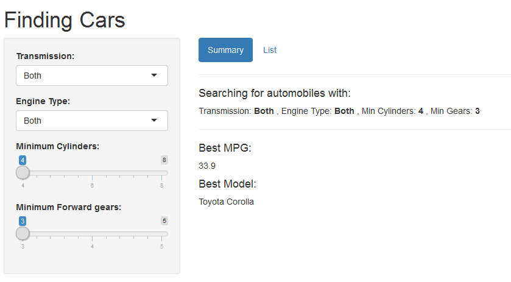

Cars MPG
========================================================
author: 
date: 
autosize: true

Summary
========================================================

This interactive web application searches through **mtcars** data collection  and returns the list of cars that meet your selection criteria, and provides in summary of the car model with the most efficient MPG.  

  1. As you change your selection, it automatically adjusts the results.
  2. It is intuitive, fast and easy to use.  
  3. Click Here:  <https://mdrobish.shinyapps.io/carsMPG/>.


DataSet
========================================================
Below is a sample data of **mtcars** data, which has been cleaned and modified for this web application


```
                         am vs cyl gear  mpg
Mazda RX4            Manual  V   6    4 21.0
Mazda RX4 Wag        Manual  V   6    4 21.0
Datsun 710           Manual  S   4    4 22.8
Hornet 4 Drive    Automatic  S   6    3 21.4
Hornet Sportabout Automatic  V   8    3 18.7
Valiant           Automatic  S   6    3 18.1
```

UI Screen - Input
========================================================
You can change the search criteria easily adjusting UI widgets.  And, the application returns the results interactively.



UI Screen - List of Automobiles
========================================================
You can also see the list of other cars meet your input criteria


